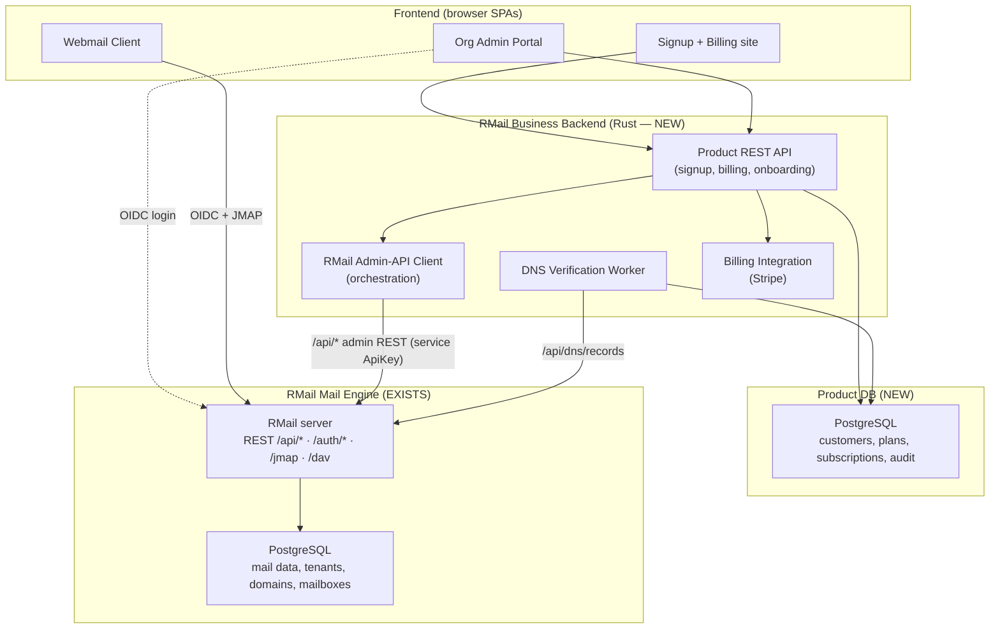
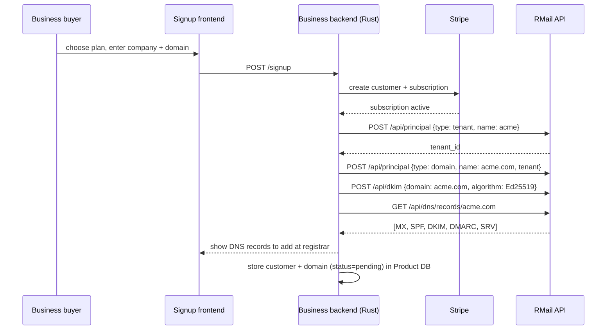
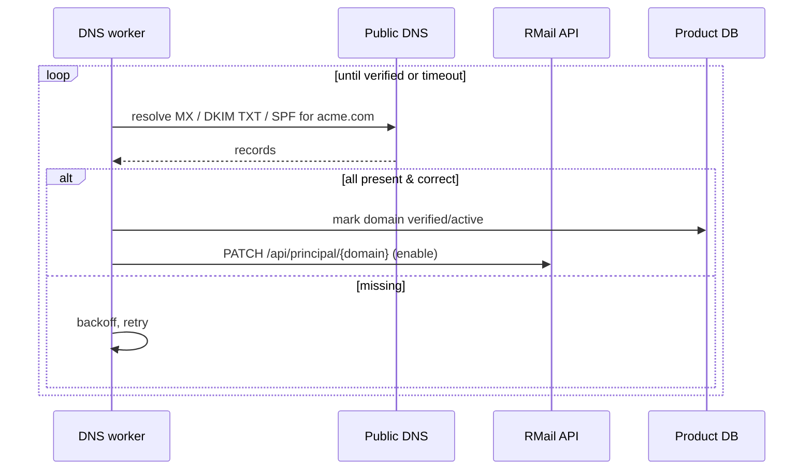
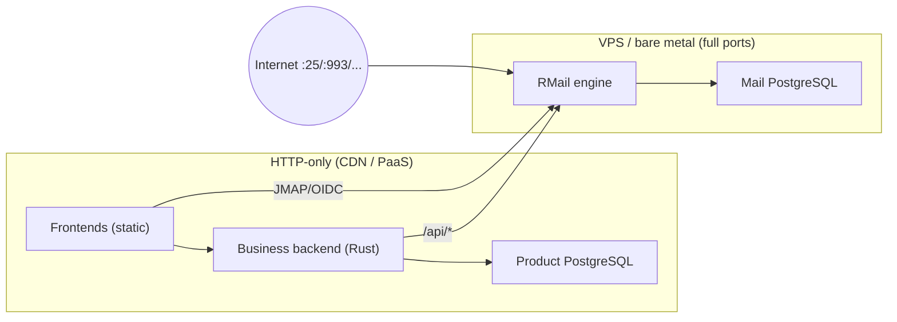

# RMail Business Email Service — Architecture & Design

> **Audience:** Backend engineers, frontend engineers, architects, DevOps
> **Status:** Proposed
> **Scope:** A dedicated, custom-domain email service for businesses, built **on top of** the RMail (Stalwart-based) mail engine.

---

## Table of Contents

1. [Purpose & Product Definition](#1-purpose--product-definition)
2. [What Already Exists vs. What We Build](#2-what-already-exists-vs-what-we-build)
3. [High-Level Architecture](#3-high-level-architecture)
4. [Component Breakdown](#4-component-breakdown)
5. [RMail API Surface We Build Against](#5-rmail-api-surface-we-build-against)
6. [The New Backend (Rust Orchestration Service)](#6-the-new-backend-rust-orchestration-service)
7. [Core Product Flows](#7-core-product-flows)
8. [New Backend Data Model](#8-new-backend-data-model)
9. [Authentication & Security Model](#9-authentication--security-model)
10. [Technology Stack](#10-technology-stack)
11. [Deployment Topology](#11-deployment-topology)
12. [Build Roadmap](#12-build-roadmap)

---

## 1. Purpose & Product Definition

We are building a **business-only, custom-domain email service** — a product where a company signs up,
connects a domain it owns (e.g. `acme.com`), proves ownership via DNS, and gets fully functional
mailboxes for its staff (`alice@acme.com`).

The product has three customer-facing surfaces:

| Surface | User | Purpose |
|---------|------|---------|
| **Signup + Billing** | Business owner / buyer | Public site: plans, payment, self-serve account creation |
| **Admin / Org portal** | Business IT admin | Add domains, verify DNS, create/manage mailboxes, view deliverability |
| **Webmail client** | End user (employee) | Read/send/search email, calendar, contacts in the browser |

The **mail engine and its database already exist** — that is RMail. Our job is the **product layer**:
the frontends, a Rust orchestration backend, and a business/billing database. We do **not** fork or
rewrite the mail server; we drive it through its APIs.

---

## 2. What Already Exists vs. What We Build

| Capability | Provided by RMail | We build |
|------------|:-----------------:|:--------:|
| SMTP / IMAP / POP3 / JMAP / DAV protocols | ✅ | |
| Mail storage (PostgreSQL backend) | ✅ | |
| Multi-tenancy (`Tenant` principal + data isolation) | ✅ | |
| Domain / user / group CRUD (REST admin API) | ✅ | |
| DKIM key generation + DNS record generation | ✅ | |
| OAuth2 / OIDC authentication | ✅ | |
| RBAC (70+ permissions, roles) | ✅ | |
| Spam filtering, queue, deliverability reports | ✅ | |
| **Public self-serve signup flow** | ❌ | ✅ |
| **Billing / plans / payments / quotas enforcement** | ❌ | ✅ |
| **DNS verification loop (poll until propagated)** | ❌ | ✅ |
| **Customer-facing webmail UI** | ❌ (only an ops admin UI) | ✅ |
| **Branded org admin portal** | ❌ | ✅ |
| **Product database (customers, subscriptions, audit)** | ❌ | ✅ |

> Reference: principal types are defined in `crates/directory/src/lib.rs:107`; the admin REST API
> contract is in `api/v1/openapi.yml`; the HTTP route table is in `crates/http/src/request.rs`.

---

## 3. High-Level Architecture



**Key principle:** the new backend owns *business* concerns (who is a customer, what plan, did they
pay, is the domain verified) and translates them into *mail* concerns by calling RMail's admin API.
The webmail client talks **directly** to RMail over JMAP for performance — the backend is not a mail proxy.

---

## 4. Component Breakdown

### 4.1 Frontends (three SPAs, shared design system)
- **Signup + Billing** — public marketing pages, plan selection, Stripe checkout, account creation.
  Talks only to the new backend's product API.
- **Org Admin Portal** — authenticated (OIDC against RMail). Add domain, show DNS records, trigger
  verification, CRUD mailboxes/groups, view quotas and deliverability dashboards.
- **Webmail Client** — authenticated (OIDC against RMail). Uses JMAP for mail and DAV for
  calendar/contacts. Real-time updates via JMAP WebSocket/EventSource.

### 4.2 RMail Business Backend (Rust — new)
The orchestration + business layer. Holds a privileged RMail **service credential** (ApiKey or admin
OAuth client). Responsibilities:
- Product REST API for the signup/billing/portal frontends.
- Translate product actions → RMail principal/DKIM/DNS calls.
- Run the DNS-verification worker (poll until MX/TXT records resolve, then activate the domain).
- Integrate billing (Stripe), enforce plan limits (max mailboxes, quota), audit logging.

### 4.3 Databases
- **Product DB (new, PostgreSQL):** customers, users-of-the-portal, subscriptions/plans, domain
  verification state, audit log, billing records. **No mailbox content here.**
- **Mail DB (existing, PostgreSQL):** owned by RMail — tenants, domains, mailboxes, messages, blobs.
  We never write to it directly; only via the RMail API.

### 4.4 RMail Mail Engine (existing)
Unchanged Stalwart-based server. Single binary serving all mail protocols + the admin REST API + JMAP.

---

## 5. RMail API Surface We Build Against

All served on RMail's HTTP listener. Source of truth: `api/v1/openapi.yml` and `crates/http/src/request.rs`.

### 5.1 Authentication — OAuth2 / OIDC (`/auth/*`, `/api/oauth`)
| Endpoint | Use |
|----------|-----|
| `POST /auth/token` | OAuth2 token (password / auth-code / refresh / device grants) |
| `POST /auth/device` | Device-code flow |
| `GET /auth/userinfo` | OIDC userinfo |
| `POST /auth/introspect` | Validate / inspect a token |
| `GET /auth/jwks.json` | JWT verification keys |
| `GET /.well-known/openid-configuration` | OIDC discovery |
| `POST /api/oauth` | Issue an admin OAuth code (admin-scoped) |

### 5.2 Admin / Provisioning — REST `/api/*` (RBAC-gated)
**Principals** — one unified CRUD endpoint, keyed by a `type` field:

| Method · Path | Purpose |
|---------------|---------|
| `GET /api/principal?types=…&page=&limit=` | List principals |
| `POST /api/principal` | Create (set `type`: `tenant` / `domain` / `individual` / `group` / `list` / `role` / `apiKey` / `oauthClient`) |
| `GET /api/principal/{id}` | Fetch one |
| `PATCH /api/principal/{id}` | Update (quota, members, secrets, permissions, …) |
| `DELETE /api/principal/{id}` | Delete |

Principal types (`crates/directory/src/lib.rs:107`): `Individual`, `Group`, `Resource`, `Location`,
`List`, `Domain`, `Tenant`, `Role`, `ApiKey`, `OauthClient`.

**Domain onboarding:**

| Method · Path | Purpose |
|---------------|---------|
| `POST /api/dkim` | Generate a DKIM signature (Ed25519 / RSA) for a domain |
| `GET /api/dns/records/{domain}` | Return the **full DNS record set** (MX, SPF, DKIM TXT, DMARC, SRV) to display to the customer |

**Operations / dashboards:** `/api/queue/*` (mail queue), `/api/reports/dmarc|tls|arf`
(deliverability), `/api/troubleshoot/delivery/{recipient}` & `/api/troubleshoot/dmarc` (diagnostics),
`/api/spam-filter/train/*`, `/api/settings` (server config), `/api/logs`, `/api/telemetry/*`.

**End-user self-service:** `/api/account/auth` (app passwords, 2FA), `/api/account/crypto`
(encryption-at-rest).

### 5.3 Webmail data plane — JMAP & DAV (`/jmap`, `/dav`)
| Endpoint | Use |
|----------|-----|
| `GET /jmap/session` | Capabilities + account discovery |
| `POST /jmap` | Read / send / search / move mail (main webmail API) |
| `POST /jmap/upload` · `GET /jmap/download` | Attachments |
| `GET /jmap/ws` · `/jmap/eventsource` | Real-time push (new mail) |
| `/dav` (CalDAV / CardDAV) | Calendar & contacts |
| `/autoconfig`, `/autodiscover`, `/.well-known/mta-sts` | Auto-setup for Outlook / Thunderbird |

### 5.4 Health / ops
`/healthz/live`, `/healthz/ready`, `/metrics/prometheus`, `/metrics/otel`.

---

## 6. The New Backend (Rust Orchestration Service)

A standalone Rust service (separate from the RMail workspace, or a sibling crate). Suggested shape:

```
rmail-business-backend/
├── src/
│   ├── main.rs              # axum HTTP server
│   ├── api/                 # product REST endpoints for the frontends
│   │   ├── signup.rs
│   │   ├── billing.rs
│   │   ├── domains.rs
│   │   └── mailboxes.rs
│   ├── rmail/               # typed client for RMail's /api/* admin API
│   │   ├── client.rs        # auth (service ApiKey), request plumbing
│   │   ├── principal.rs     # tenant/domain/individual CRUD
│   │   ├── dkim.rs
│   │   └── dns.rs
│   ├── billing/             # Stripe integration
│   ├── dns/                 # verification worker (poll DNS resolvers)
│   ├── db/                  # product DB (sqlx/SeaORM)
│   └── auth.rs              # validate OIDC tokens via RMail JWKS
└── Cargo.toml               # axum, reqwest, sqlx, tokio, stripe-rust
```

The RMail client authenticates with a long-lived **ApiKey principal** (created once during setup) and
calls `/api/*` with the appropriate permissions. Plan limits are enforced *before* calling RMail (e.g.
refuse to create a 51st mailbox on a 50-seat plan).

---

## 7. Core Product Flows

### 7.1 Signup → tenant → domain → DKIM → DNS → mailboxes



### 7.2 DNS verification (async worker)



### 7.3 Admin creates a mailbox
`Portal → BE POST /domains/{d}/mailboxes` → BE checks plan seat limit → `BE → RM POST /api/principal {type: individual, name: alice@acme.com, secret, quota}`.

### 7.4 Webmail login & use
`Webmail → OIDC login at RMail (/auth/token)` → token → `Webmail → GET /jmap/session` → `POST /jmap`
for mail ops, `/jmap/ws` for push. The business backend is **not** in this path.

---

## 8. New Backend Data Model

Product DB only — mail content stays in RMail. Indicative tables:

| Table | Key fields |
|-------|-----------|
| `customers` | id, company_name, rmail_tenant_id, plan, status, created_at |
| `portal_users` | id, customer_id, email, role, last_login |
| `subscriptions` | id, customer_id, stripe_subscription_id, seats, status, renews_at |
| `domains` | id, customer_id, fqdn, rmail_domain_id, verification_status, dkim_selector, verified_at |
| `dns_checks` | id, domain_id, record_type, expected, observed, checked_at |
| `mailbox_index` | id, customer_id, domain_id, address, rmail_principal_id (lightweight mirror for limits/UX) |
| `audit_log` | id, customer_id, actor, action, target, metadata, at |
| `invoices` | id, customer_id, stripe_invoice_id, amount, status, period |

> `rmail_*_id` columns link product rows to RMail principals — the join key between the two systems.

---

## 9. Authentication & Security Model

- **End users & admins** authenticate against **RMail's OIDC** (`/auth/token`); frontends and the
  business backend verify JWTs via `/auth/jwks.json`. RMail remains the single identity source.
- **Business backend → RMail** uses a dedicated **`ApiKey` principal** with only the permissions it
  needs (principal CRUD, DKIM, DNS, settings). Store it in a secret manager, never in the frontend.
- **Signup-only endpoints** (pre-auth) live solely on the business backend and must be rate-limited
  and bot-protected; they are the only unauthenticated write path.
- **Tenant isolation** is enforced by RMail (`Tenant` scoping); the backend additionally enforces
  plan/seat limits before provisioning.
- **Secrets** (mailbox passwords) are set via RMail; the backend should never persist them.

---

## 10. Technology Stack

| Layer | Recommendation | Rationale |
|-------|----------------|-----------|
| Frontend | React + TypeScript (Vite), one shared component library | Webmail needs a rich SPA; share design across all three surfaces |
| Webmail data | JMAP client (e.g. `jmap-client` JS) | Native fit for RMail's `/jmap` |
| Backend | **Rust + axum** | Matches RMail's stack; strong concurrency for the API + DNS worker |
| RMail client | `reqwest` (typed wrappers) | Calls `/api/*` |
| Product DB | PostgreSQL + `sqlx` | Same DB tech as RMail; compile-checked queries |
| Billing | Stripe (`stripe-rust`) | Subscriptions, invoices, webhooks |
| Auth | OIDC tokens from RMail, JWT verify in backend | Single identity source |

---

## 11. Deployment Topology

> **Note:** the mail engine needs real ports (25/465/587/143/993/110/995/4190) and inbound port 25,
> which most PaaS (incl. Railway) cannot provide. Run the **mail engine** on infrastructure with full
> port access; the **frontends and business backend are pure HTTP** and can run anywhere.



---

## 12. Build Roadmap

| Phase | Deliverable |
|-------|-------------|
| **0 — Foundations** | Stand up RMail with PostgreSQL on a full-port host; create the service `ApiKey`; confirm `/api/principal`, `/api/dkim`, `/api/dns/records` work end to end |
| **1 — Backend core** | Rust backend skeleton: RMail client, product DB schema, OIDC token verification |
| **2 — Onboarding** | Signup API → create tenant/domain/DKIM; DNS-records display; DNS verification worker |
| **3 — Billing** | Stripe checkout + webhooks; plan/seat enforcement |
| **4 — Admin portal** | Frontend for domains, mailboxes, quotas, deliverability dashboards |
| **5 — Webmail** | JMAP-based webmail client (inbox, compose, search, push); DAV calendar/contacts |
| **6 — Hardening** | Audit logging, rate limiting, monitoring, backups, multi-domain per tenant |

---

*This document defines the product layer only. The mail engine internals are documented in
`docs/SYSTEM_DESIGN.md`; multi-tenant management specifics are in `docs/ORGANIZATION_MANAGEMENT_PLAN.md`.*
