# RMail System Design

> **Audience:** Backend engineers, architects, DevOps  
> **Last updated:** 2026-03-09  
> **Status:** Current (based on v0.15.x codebase)

---

## Table of Contents

1. [Executive Summary](#1-executive-summary)
2. [High-Level Architecture](#2-high-level-architecture)
3. [Component Architecture](#3-component-architecture)
4. [Protocol Stack](#4-protocol-stack)
5. [Storage Architecture](#5-storage-architecture)
6. [Authentication & Authorization](#6-authentication--authorization)
7. [Email Delivery Pipeline](#7-email-delivery-pipeline)
8. [Background Services](#8-background-services)
9. [Clustering & High Availability](#9-clustering--high-availability)
10. [Multi-Tenancy Model](#10-multi-tenancy-model)
11. [Deployment Topologies](#11-deployment-topologies)
12. [API Surface](#12-api-surface)
13. [Resillix-Modified Architecture](#13-resillix-modified-architecture)
14. [Appendix: Crate Map](#appendix-crate-map)

---

## 1. Executive Summary

RMail is a Rust-based, high-performance mail and collaboration server forked from [Stalwart](https://stalw.art). It provides complete email delivery (SMTP), mailbox access (IMAP/POP3/JMAP), collaboration (CalDAV/CardDAV/WebDAV), and administration (REST API + web dashboard) in a single binary.

**Key design principles:**

| Principle | Implementation |
|-----------|---------------|
| **Memory safety** | Written entirely in Rust — no C/C++ runtime dependencies |
| **Async I/O** | Tokio runtime with zero-copy networking |
| **Pluggable storage** | 11 storage backends behind a unified trait |
| **Protocol-complete** | SMTP, IMAP4rev2, POP3, JMAP, CalDAV, CardDAV, WebDAV, ManageSieve |
| **Multi-tenant** | Tenant-scoped data isolation, RBAC with 70+ permissions |
| **Cloud-native** | Docker, Railway, Kubernetes, horizontal scaling via pub/sub |

---

## 2. High-Level Architecture

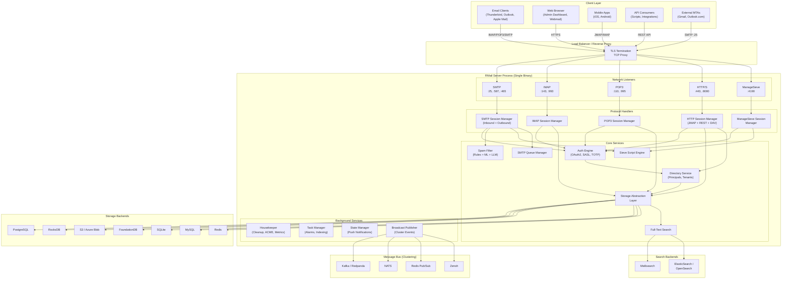
```mermaid
graph TB
    subgraph Clients["Client Layer"]
        MUA["Email Clients<br/>(Thunderbird, Outlook, Apple Mail)"]
        WEB["Web Browser<br/>(Admin Dashboard, Webmail)"]
        MOB["Mobile Apps<br/>(iOS, Android)"]
        API_CLIENT["API Consumers<br/>(Scripts, Integrations)"]
        MTA_EXT["External MTAs<br/>(Gmail, Outlook.com)"]
    end

    subgraph LB["Load Balancer / Reverse Proxy"]
        NGINX["TLS Termination<br/>TCP Proxy"]
    end

    subgraph RMail["RMail Server Process (Single Binary)"]
        direction TB

        subgraph Listeners["Network Listeners"]
            SMTP_L["SMTP<br/>:25, :587, :465"]
            IMAP_L["IMAP<br/>:143, :993"]
            POP3_L["POP3<br/>:110, :995"]
            HTTP_L["HTTP/S<br/>:443, :8080"]
            SIEVE_L["ManageSieve<br/>:4190"]
        end

        subgraph Protocols["Protocol Handlers"]
            SMTP_H["SMTP Session Manager<br/>(Inbound + Outbound)"]
            IMAP_H["IMAP Session Manager"]
            POP3_H["POP3 Session Manager"]
            HTTP_H["HTTP Session Manager<br/>(JMAP + REST + DAV)"]
            SIEVE_H["ManageSieve Session<br/>Manager"]
        end

        subgraph Core["Core Services"]
            AUTH["Auth Engine<br/>(OAuth2, SASL, TOTP)"]
            DIRECTORY["Directory Service<br/>(Principals, Tenants)"]
            STORE_LAYER["Storage Abstraction<br/>Layer"]
            SPAM["Spam Filter<br/>(Rules + ML + LLM)"]
            SIEVE_ENGINE["Sieve Script Engine"]
            QUEUE["SMTP Queue Manager"]
            FTS["Full-Text Search"]
        end

        subgraph BG["Background Services"]
            HOUSEKEEPER["Housekeeper<br/>(Cleanup, ACME, Metrics)"]
            TASK_MGR["Task Manager<br/>(Alarms, Indexing)"]
            STATE_MGR["State Manager<br/>(Push Notifications)"]
            BROADCAST["Broadcast Publisher<br/>(Cluster Events)"]
        end
    end

    subgraph Storage["Storage Backends"]
        direction LR
        PG["PostgreSQL"]
        ROCKS["RocksDB"]
        S3["S3 / Azure Blob"]
        REDIS_STORE["Redis"]
        FDB["FoundationDB"]
        SQLITE["SQLite"]
        MYSQL["MySQL"]
    end

    subgraph Search["Search Backends"]
        MEILI["Meilisearch"]
        ELASTIC["ElasticSearch /<br/>OpenSearch"]
    end

    subgraph PubSub["Message Bus (Clustering)"]
        KAFKA["Kafka / Redpanda"]
        NATS["NATS"]
        REDIS_PS["Redis Pub/Sub"]
        ZENOH["Zenoh"]
    end

    MUA -->|IMAP/POP3/SMTP| NGINX
    WEB -->|HTTPS| NGINX
    MOB -->|JMAP/IMAP| NGINX
    API_CLIENT -->|REST API| NGINX
    MTA_EXT -->|SMTP :25| NGINX

    NGINX --> SMTP_L
    NGINX --> IMAP_L
    NGINX --> POP3_L
    NGINX --> HTTP_L
    NGINX --> SIEVE_L

    SMTP_L --> SMTP_H
    IMAP_L --> IMAP_H
    POP3_L --> POP3_H
    HTTP_L --> HTTP_H
    SIEVE_L --> SIEVE_H

    SMTP_H --> AUTH
    SMTP_H --> SPAM
    SMTP_H --> SIEVE_ENGINE
    SMTP_H --> QUEUE
    IMAP_H --> AUTH
    IMAP_H --> STORE_LAYER
    POP3_H --> AUTH
    POP3_H --> STORE_LAYER
    HTTP_H --> AUTH
    HTTP_H --> STORE_LAYER
    HTTP_H --> DIRECTORY
    SIEVE_H --> AUTH
    SIEVE_H --> SIEVE_ENGINE

    AUTH --> DIRECTORY
    DIRECTORY --> STORE_LAYER

    STORE_LAYER --> PG
    STORE_LAYER --> ROCKS
    STORE_LAYER --> S3
    STORE_LAYER --> FDB
    STORE_LAYER --> SQLITE
    STORE_LAYER --> MYSQL
    STORE_LAYER --> REDIS_STORE
    FTS --> MEILI
    FTS --> ELASTIC
    STORE_LAYER --> FTS

    BROADCAST --> KAFKA
    BROADCAST --> NATS
    BROADCAST --> REDIS_PS
    BROADCAST --> ZENOH
```

---

## 3. Component Architecture

### 3.1 Crate Dependency Graph

The server is organized as a Cargo workspace with 27 crates. The dependency flow is strictly layered:

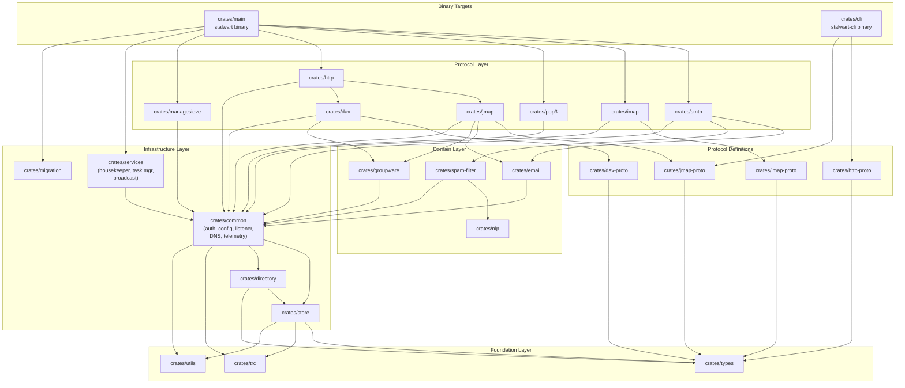
```mermaid
graph TD
    subgraph Binary["Binary Targets"]
        MAIN["crates/main<br/>stalwart binary"]
        CLI["crates/cli<br/>stalwart-cli binary"]
    end

    subgraph Protocol["Protocol Layer"]
        SMTP_C["crates/smtp"]
        IMAP_C["crates/imap"]
        POP3_C["crates/pop3"]
        JMAP_C["crates/jmap"]
        DAV_C["crates/dav"]
        HTTP_C["crates/http"]
        MSIEVE["crates/managesieve"]
    end

    subgraph Proto["Protocol Definitions"]
        IMAP_P["crates/imap-proto"]
        JMAP_P["crates/jmap-proto"]
        HTTP_P["crates/http-proto"]
        DAV_P["crates/dav-proto"]
    end

    subgraph Domain["Domain Layer"]
        EMAIL_C["crates/email"]
        SPAM_C["crates/spam-filter"]
        NLP_C["crates/nlp"]
        GW_C["crates/groupware"]
    end

    subgraph Infra["Infrastructure Layer"]
        COMMON["crates/common<br/>(auth, config, listener,<br/>DNS, telemetry)"]
        SERVICES["crates/services<br/>(housekeeper, task mgr,<br/>broadcast)"]
        STORE_C["crates/store"]
        DIR_C["crates/directory"]
        MIG_C["crates/migration"]
    end

    subgraph Foundation["Foundation Layer"]
        TYPES["crates/types"]
        TRC["crates/trc"]
        UTILS["crates/utils"]
    end

    MAIN --> SMTP_C & IMAP_C & POP3_C & HTTP_C & MSIEVE & SERVICES & MIG_C
    CLI --> HTTP_P & JMAP_P

    SMTP_C --> EMAIL_C & SPAM_C & COMMON
    IMAP_C --> IMAP_P & COMMON
    POP3_C --> COMMON
    HTTP_C --> JMAP_C & DAV_C & COMMON
    JMAP_C --> JMAP_P & EMAIL_C & GW_C & COMMON
    DAV_C --> DAV_P & GW_C & COMMON
    MSIEVE --> COMMON

    EMAIL_C --> COMMON
    SPAM_C --> NLP_C & COMMON
    GW_C --> COMMON

    COMMON --> STORE_C & DIR_C & TRC & UTILS
    STORE_C --> TYPES & TRC & UTILS
    DIR_C --> STORE_C & TYPES
    SERVICES --> COMMON

    IMAP_P --> TYPES
    JMAP_P --> TYPES
    DAV_P --> TYPES
    HTTP_P --> TYPES
```

### 3.2 Session Manager Pattern

Every protocol uses the same `SessionManager` trait for connection lifecycle:

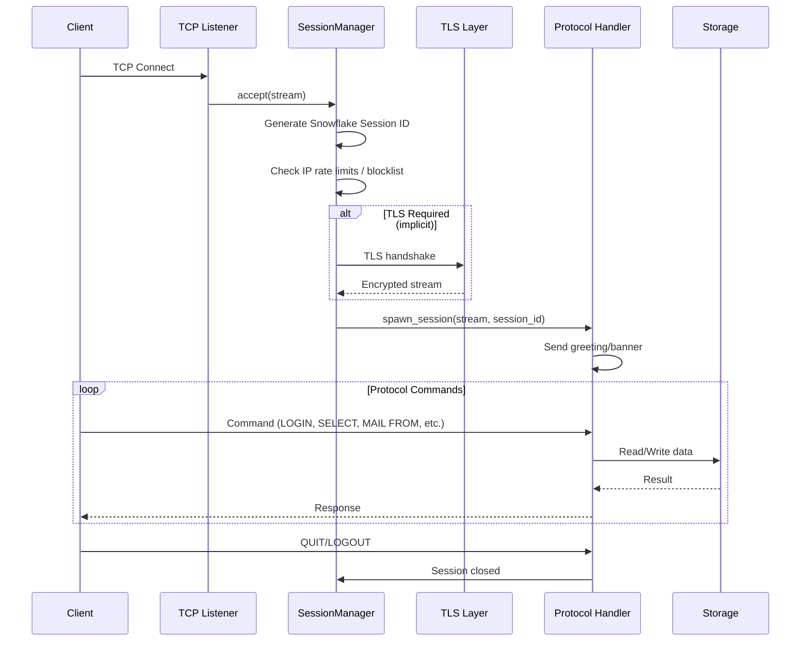
```mermaid
sequenceDiagram
    participant C as Client
    participant L as TCP Listener
    participant SM as SessionManager
    participant TLS as TLS Layer
    participant H as Protocol Handler
    participant S as Storage

    C->>L: TCP Connect
    L->>SM: accept(stream)
    SM->>SM: Generate Snowflake Session ID
    SM->>SM: Check IP rate limits / blocklist
    alt TLS Required (implicit)
        SM->>TLS: TLS handshake
        TLS-->>SM: Encrypted stream
    end
    SM->>H: spawn_session(stream, session_id)
    H->>H: Send greeting/banner
    loop Protocol Commands
        C->>H: Command (LOGIN, SELECT, MAIL FROM, etc.)
        H->>S: Read/Write data
        S-->>H: Result
        H-->>C: Response
    end
    C->>H: QUIT/LOGOUT
    H->>SM: Session closed
```

---

## 4. Protocol Stack

### 4.1 Supported Protocols

```
┌──────────────────────────────────────────────────────────────────────────┐
│                        APPLICATION PROTOCOLS                            │
├──────────┬──────────┬────────┬──────────┬──────────┬──────────┬────────┤
│   SMTP   │  IMAP4   │  POP3  │   JMAP   │  CalDAV  │ CardDAV  │ WebDAV │
│  :25     │  :143    │  :110  │  :443    │  :443    │  :443    │  :443  │
│  :587    │  :993    │  :995  │          │          │          │        │
│  :465    │  (TLS)   │ (TLS)  │          │          │          │        │
├──────────┴──────────┴────────┤          │          │          │        │
│     ManageSieve :4190        │  HTTP/S Layer (unified)                 │
├──────────────────────────────┴──────────┴──────────┴──────────┴────────┤
│                    TLS 1.2 / TLS 1.3 (ACME auto-provisioning)         │
├───────────────────────────────────────────────────────────────────────────┤
│                         TCP / Tokio Async I/O                           │
└───────────────────────────────────────────────────────────────────────────┘
```

### 4.2 Protocol Feature Matrix

| Protocol | Auth Mechanisms | Encryption | Key Extensions |
|----------|----------------|------------|----------------|
| **SMTP** | PLAIN, LOGIN, CRAM-MD5, SCRAM-SHA-256 | STARTTLS, Implicit TLS | DKIM, DMARC, SPF, ARC, DANE, MTA-STS, DSN, CHUNKING, 8BITMIME |
| **IMAP** | PLAIN, LOGIN, OAUTHBEARER | STARTTLS, Implicit TLS | IDLE, CONDSTORE, QRESYNC, MOVE, LITERAL+, SPECIAL-USE, ACL, QUOTA |
| **POP3** | PLAIN, USER/PASS, APOP | STLS, Implicit TLS | UIDL, TOP, RESP-CODES |
| **JMAP** | Bearer Token (OAuth2) | HTTPS | Mail, Calendars, Contacts, Files, Sieve, WebSocket, Blob, Quotas, Sharing |
| **CalDAV** | Basic, Bearer | HTTPS | Scheduling (RFC 6638), Time Zones, Attachments |
| **CardDAV** | Basic, Bearer | HTTPS | vCard 4.0, Address Books |
| **WebDAV** | Basic, Bearer | HTTPS | LOCK, COPY, MOVE, ACL (RFC 3744) |
| **ManageSieve** | PLAIN, LOGIN | STARTTLS | All IANA-registered Sieve extensions |

---

## 5. Storage Architecture

### 5.1 Storage Abstraction

The storage layer separates concerns into four distinct roles, each independently configurable:

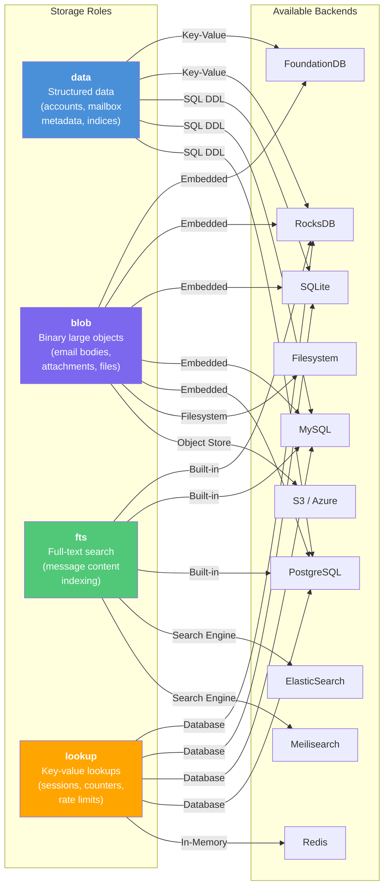
```mermaid
graph LR
    subgraph Roles["Storage Roles"]
        DATA["<b>data</b><br/>Structured data<br/>(accounts, mailbox<br/>metadata, indices)"]
        BLOB["<b>blob</b><br/>Binary large objects<br/>(email bodies,<br/>attachments, files)"]
        FTS_R["<b>fts</b><br/>Full-text search<br/>(message content<br/>indexing)"]
        LOOKUP["<b>lookup</b><br/>Key-value lookups<br/>(sessions, counters,<br/>rate limits)"]
    end

    subgraph Backends["Available Backends"]
        PG["PostgreSQL"]
        MY["MySQL"]
        SQ["SQLite"]
        RK["RocksDB"]
        FD["FoundationDB"]
        S3B["S3 / Azure"]
        FS["Filesystem"]
        RD["Redis"]
        ML["Meilisearch"]
        ES["ElasticSearch"]
    end

    DATA -->|"SQL DDL"| PG & MY & SQ
    DATA -->|"Key-Value"| RK & FD
    BLOB -->|"Object Store"| S3B
    BLOB -->|"Filesystem"| FS
    BLOB -->|"Embedded"| PG & MY & SQ & RK & FD
    FTS_R -->|"Search Engine"| ML & ES
    FTS_R -->|"Built-in"| PG & MY & RK
    LOOKUP -->|"In-Memory"| RD
    LOOKUP -->|"Database"| PG & MY & SQ & RK

    style DATA fill:#4a90d9,color:#fff
    style BLOB fill:#7b68ee,color:#fff
    style FTS_R fill:#50c878,color:#fff
    style LOOKUP fill:#ffa500,color:#fff
```

### 5.2 Configuration Example (Mixed Backends)

```toml
# Production example: PostgreSQL for data, S3 for blobs, Meilisearch for search
[storage]
data      = "postgres"     # Structured data → PostgreSQL
blob      = "s3"           # Large objects → S3
fts       = "meili"        # Full-text search → Meilisearch
lookup    = "redis"        # Fast lookups → Redis
directory = "internal"     # User directory → same as data store

[store."postgres"]
type = "postgresql"
url  = "postgresql://user:pass@db:5432/rmail"
pool.max-connections = 20

[store."s3"]
type            = "s3"
bucket          = "rmail-blobs"
region          = "us-east-1"
access-key      = "%{env:AWS_ACCESS_KEY}%"
secret-key      = "%{env:AWS_SECRET_KEY}%"

[store."meili"]
type = "meilisearch"
url  = "http://meili:7700"
key  = "%{env:MEILI_KEY}%"

[store."redis"]
type = "redis"
urls = "redis://redis:6379"
```

### 5.3 Data Model

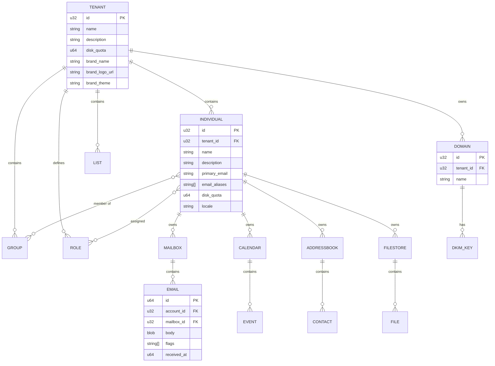
```mermaid
erDiagram
    TENANT ||--o{ DOMAIN : "owns"
    TENANT ||--o{ INDIVIDUAL : "contains"
    TENANT ||--o{ GROUP : "contains"
    TENANT ||--o{ LIST : "contains"
    TENANT ||--o{ ROLE : "defines"

    INDIVIDUAL ||--o{ MAILBOX : "owns"
    INDIVIDUAL ||--o{ CALENDAR : "owns"
    INDIVIDUAL ||--o{ ADDRESSBOOK : "owns"
    INDIVIDUAL ||--o{ FILESTORE : "owns"
    INDIVIDUAL }o--o{ GROUP : "member of"
    INDIVIDUAL }o--o{ ROLE : "assigned"

    MAILBOX ||--o{ EMAIL : "contains"
    CALENDAR ||--o{ EVENT : "contains"
    ADDRESSBOOK ||--o{ CONTACT : "contains"
    FILESTORE ||--o{ FILE : "contains"

    DOMAIN ||--o{ DKIM_KEY : "has"

    TENANT {
        u32 id PK
        string name
        string description
        u64 disk_quota
        string brand_name
        string brand_logo_url
        string brand_theme
    }

    INDIVIDUAL {
        u32 id PK
        u32 tenant_id FK
        string name
        string description
        string primary_email
        string[] email_aliases
        u64 disk_quota
        string locale
    }

    DOMAIN {
        u32 id PK
        u32 tenant_id FK
        string name
    }

    EMAIL {
        u64 id PK
        u32 account_id FK
        u32 mailbox_id FK
        blob body
        string[] flags
        u64 received_at
    }
```

---

## 6. Authentication & Authorization

### 6.1 Authentication Flow

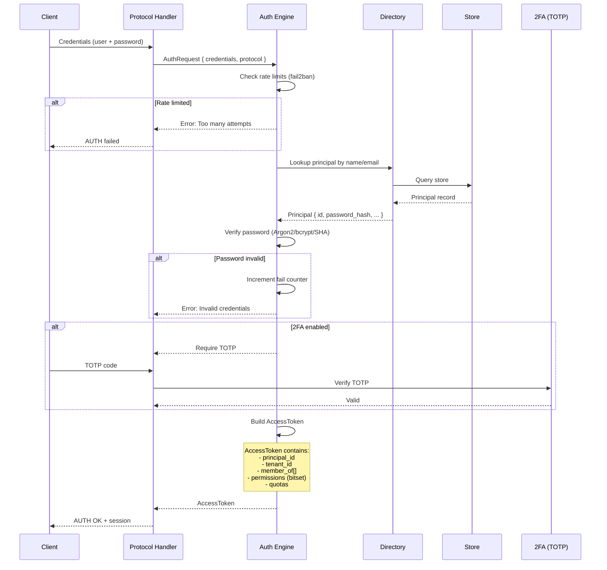
```mermaid
sequenceDiagram
    participant C as Client
    participant P as Protocol Handler
    participant A as Auth Engine
    participant D as Directory
    participant S as Store
    participant F2 as 2FA (TOTP)

    C->>P: Credentials (user + password)
    P->>A: AuthRequest { credentials, protocol }
    A->>A: Check rate limits (fail2ban)
    alt Rate limited
        A-->>P: Error: Too many attempts
        P-->>C: AUTH failed
    end
    A->>D: Lookup principal by name/email
    D->>S: Query store
    S-->>D: Principal record
    D-->>A: Principal { id, password_hash, ... }
    A->>A: Verify password (Argon2/bcrypt/SHA)
    alt Password invalid
        A->>A: Increment fail counter
        A-->>P: Error: Invalid credentials
    end
    alt 2FA enabled
        A-->>P: Require TOTP
        C->>P: TOTP code
        P->>F2: Verify TOTP
        F2-->>P: Valid
    end
    A->>A: Build AccessToken
    Note over A: AccessToken contains:<br/>- principal_id<br/>- tenant_id<br/>- member_of[]<br/>- permissions (bitset)<br/>- quotas
    A-->>P: AccessToken
    P-->>C: AUTH OK + session
```

### 6.2 Authorization Model

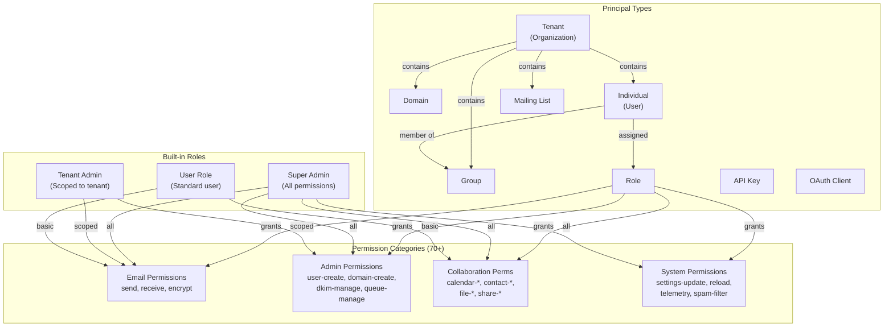
```mermaid
graph TD
    subgraph Principals["Principal Types"]
        T["Tenant<br/>(Organization)"]
        D["Domain"]
        U["Individual<br/>(User)"]
        G["Group"]
        R["Role"]
        L["Mailing List"]
        AK["API Key"]
        OC["OAuth Client"]
    end

    subgraph Roles["Built-in Roles"]
        SA["Super Admin<br/>(All permissions)"]
        TA["Tenant Admin<br/>(Scoped to tenant)"]
        UR["User Role<br/>(Standard user)"]
    end

    subgraph Permissions["Permission Categories (70+)"]
        P_MAIL["Email Permissions<br/>send, receive, encrypt"]
        P_ADMIN["Admin Permissions<br/>user-create, domain-create,<br/>dkim-manage, queue-manage"]
        P_COLLAB["Collaboration Perms<br/>calendar-*, contact-*,<br/>file-*, share-*"]
        P_SYS["System Permissions<br/>settings-update, reload,<br/>telemetry, spam-filter"]
    end

    T -->|"contains"| D & U & G & L
    U -->|"member of"| G
    U -->|"assigned"| R
    R -->|"grants"| P_MAIL & P_ADMIN & P_COLLAB & P_SYS
    SA -->|"all"| P_MAIL & P_ADMIN & P_COLLAB & P_SYS
    TA -->|"scoped"| P_ADMIN & P_MAIL
    UR -->|"basic"| P_MAIL & P_COLLAB
```

### 6.3 Supported Auth Backends

```
┌──────────────────────────────────────────────────────────┐
│                    Auth Request                          │
├──────────────────────────────────────────────────────────┤
│                                                          │
│  ┌──────────┐  ┌──────────┐  ┌──────────┐              │
│  │ Internal │  │   LDAP   │  │   SQL    │              │
│  │Directory │  │ Backend  │  │ Backend  │              │
│  └──────────┘  └──────────┘  └──────────┘              │
│                                                          │
│  ┌──────────┐  ┌──────────┐  ┌──────────┐              │
│  │  OIDC /  │  │   IMAP   │  │   SMTP   │              │
│  │ OAuth2   │  │ Backend  │  │ Backend  │              │
│  └──────────┘  └──────────┘  └──────────┘              │
│                                                          │
│  ┌─────────────────────┐  ┌──────────────────┐          │
│  │ Fallback Admin      │  │ Master User      │          │
│  │ (config.toml)       │  │ (admin override)  │          │
│  └─────────────────────┘  └──────────────────┘          │
└──────────────────────────────────────────────────────────┘
```

---

## 7. Email Delivery Pipeline

### 7.1 Inbound Email (Receiving)

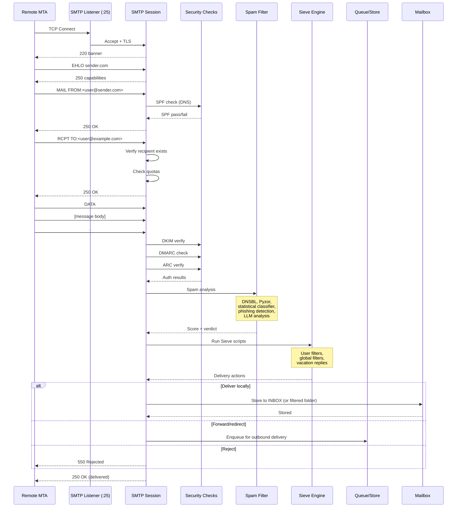
```mermaid
sequenceDiagram
    participant MTA as Remote MTA
    participant L as SMTP Listener (:25)
    participant S as SMTP Session
    participant SEC as Security Checks
    participant SF as Spam Filter
    participant SV as Sieve Engine
    participant Q as Queue/Store
    participant MB as Mailbox

    MTA->>L: TCP Connect
    L->>S: Accept + TLS
    S-->>MTA: 220 banner

    MTA->>S: EHLO sender.com
    S-->>MTA: 250 capabilities

    MTA->>S: MAIL FROM:<user@sender.com>
    S->>SEC: SPF check (DNS)
    SEC-->>S: SPF pass/fail
    S-->>MTA: 250 OK

    MTA->>S: RCPT TO:<user@example.com>
    S->>S: Verify recipient exists
    S->>S: Check quotas
    S-->>MTA: 250 OK

    MTA->>S: DATA
    MTA->>S: [message body]
    MTA->>S: .

    S->>SEC: DKIM verify
    S->>SEC: DMARC check
    S->>SEC: ARC verify
    SEC-->>S: Auth results

    S->>SF: Spam analysis
    Note over SF: DNSBL, Pyzor,<br/>statistical classifier,<br/>phishing detection,<br/>LLM analysis
    SF-->>S: Score + verdict

    S->>SV: Run Sieve scripts
    Note over SV: User filters,<br/>global filters,<br/>vacation replies
    SV-->>S: Delivery actions

    alt Deliver locally
        S->>MB: Store to INBOX (or filtered folder)
        MB-->>S: Stored
    else Forward/redirect
        S->>Q: Enqueue for outbound delivery
    else Reject
        S-->>MTA: 550 Rejected
    end

    S-->>MTA: 250 OK (delivered)
```

### 7.2 Outbound Email (Sending)

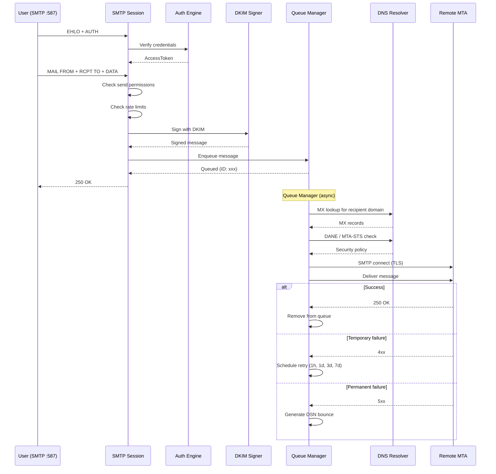
```mermaid
sequenceDiagram
    participant U as User (SMTP :587)
    participant S as SMTP Session
    participant A as Auth Engine
    participant SK as DKIM Signer
    participant Q as Queue Manager
    participant DNS as DNS Resolver
    participant R as Remote MTA

    U->>S: EHLO + AUTH
    S->>A: Verify credentials
    A-->>S: AccessToken

    U->>S: MAIL FROM + RCPT TO + DATA
    S->>S: Check send permissions
    S->>S: Check rate limits

    S->>SK: Sign with DKIM
    SK-->>S: Signed message

    S->>Q: Enqueue message
    Q-->>S: Queued (ID: xxx)
    S-->>U: 250 OK

    Note over Q: Queue Manager (async)
    Q->>DNS: MX lookup for recipient domain
    DNS-->>Q: MX records
    Q->>DNS: DANE / MTA-STS check
    DNS-->>Q: Security policy

    Q->>R: SMTP connect (TLS)
    Q->>R: Deliver message
    alt Success
        R-->>Q: 250 OK
        Q->>Q: Remove from queue
    else Temporary failure
        R-->>Q: 4xx
        Q->>Q: Schedule retry (1h, 1d, 3d, 7d)
    else Permanent failure
        R-->>Q: 5xx
        Q->>Q: Generate DSN bounce
    end
```

### 7.3 Queue Architecture

```
┌─────────────────────────────────────────────────────────┐
│                    SMTP Queue Manager                    │
├─────────────────────────────────────────────────────────┤
│                                                          │
│  ┌───────────────┐  ┌───────────────┐                   │
│  │  Spool Store  │  │  Throttle     │                   │
│  │  (persistent) │  │  Engine       │                   │
│  │               │  │               │                   │
│  │  - message    │  │  - per-domain │                   │
│  │    bodies     │  │  - per-IP     │                   │
│  │  - envelopes  │  │  - per-tenant │                   │
│  │  - retry info │  │  - global     │                   │
│  └───────────────┘  └───────────────┘                   │
│                                                          │
│  ┌───────────────┐  ┌───────────────┐                   │
│  │  DSN          │  │  Quota        │                   │
│  │  Generator    │  │  Manager      │                   │
│  │               │  │               │                   │
│  │  - bounces    │  │  - queue size │                   │
│  │  - delays     │  │  - per-user   │                   │
│  │  - success    │  │  - per-tenant │                   │
│  └───────────────┘  └───────────────┘                   │
│                                                          │
│  Retry Schedule: 1h → 1d → 3d → 7d (configurable)      │
│  Concurrency: up to 256 parallel outbound connections    │
│  Expiry: 7 days default                                  │
└─────────────────────────────────────────────────────────┘
```

---

## 8. Background Services


```mermaid
graph TB
    subgraph Services["Background Services (Tokio Tasks)"]
        HK["<b>Housekeeper</b><br/>Periodic maintenance"]
        TM["<b>Task Manager</b><br/>Async job processing"]
        SM["<b>State Manager</b><br/>Push notifications"]
        BP["<b>Broadcast Publisher</b><br/>Cluster event sync"]
        QM["<b>Queue Manager</b><br/>SMTP outbound delivery"]
    end

    subgraph HK_Tasks["Housekeeper Tasks"]
        HK1["Purge expired sessions"]
        HK2["ACME certificate renewal"]
        HK3["Quota recalculation"]
        HK4["Metrics collection"]
        HK5["DMARC/TLS report generation"]
        HK6["Blob store cleanup"]
    end

    subgraph TM_Tasks["Task Manager Jobs"]
        TM1["Calendar alarm processing"]
        TM2["Full-text index updates"]
        TM3["Thread merge operations"]
        TM4["iMIP scheduling messages"]
        TM5["Email import/export"]
    end

    subgraph SM_Tasks["State Manager"]
        SM1["JMAP push notifications"]
        SM2["HTTP event callbacks"]
        SM3["WebSocket state changes"]
    end

    subgraph BP_Events["Broadcast Events"]
        BP1["InvalidateAccessTokens"]
        BP2["ReloadSettings"]
        BP3["ReloadBlockedIps"]
        BP4["ReloadSpamFilter"]
        BP5["StateChange (JMAP)"]
        BP6["CalendarAlert"]
    end

    HK --> HK1 & HK2 & HK3 & HK4 & HK5 & HK6
    TM --> TM1 & TM2 & TM3 & TM4 & TM5
    SM --> SM1 & SM2 & SM3
    BP --> BP1 & BP2 & BP3 & BP4 & BP5 & BP6
```

---

## 9. Clustering & High Availability

### 9.1 Cluster Topology

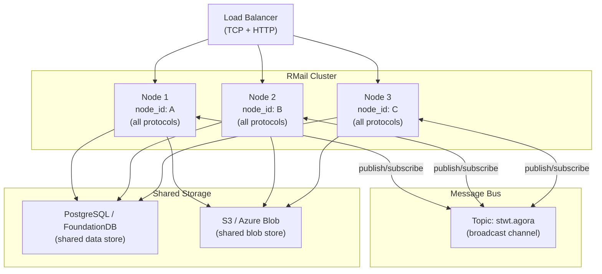
```mermaid
graph TB
    subgraph Cluster["RMail Cluster"]
        N1["Node 1<br/>node_id: A<br/>(all protocols)"]
        N2["Node 2<br/>node_id: B<br/>(all protocols)"]
        N3["Node 3<br/>node_id: C<br/>(all protocols)"]
    end

    subgraph Bus["Message Bus"]
        TOPIC["Topic: stwt.agora<br/>(broadcast channel)"]
    end

    subgraph SharedStorage["Shared Storage"]
        DB["PostgreSQL / FoundationDB<br/>(shared data store)"]
        BLOB["S3 / Azure Blob<br/>(shared blob store)"]
    end

    N1 <-->|"publish/subscribe"| TOPIC
    N2 <-->|"publish/subscribe"| TOPIC
    N3 <-->|"publish/subscribe"| TOPIC

    N1 --> DB & BLOB
    N2 --> DB & BLOB
    N3 --> DB & BLOB

    LB["Load Balancer<br/>(TCP + HTTP)"] --> N1 & N2 & N3
```

### 9.2 Broadcast Protocol

Each node publishes events to the `stwt.agora` topic. Events are serialized with LEB128 encoding and include the originating `node_id` so nodes can filter their own messages.

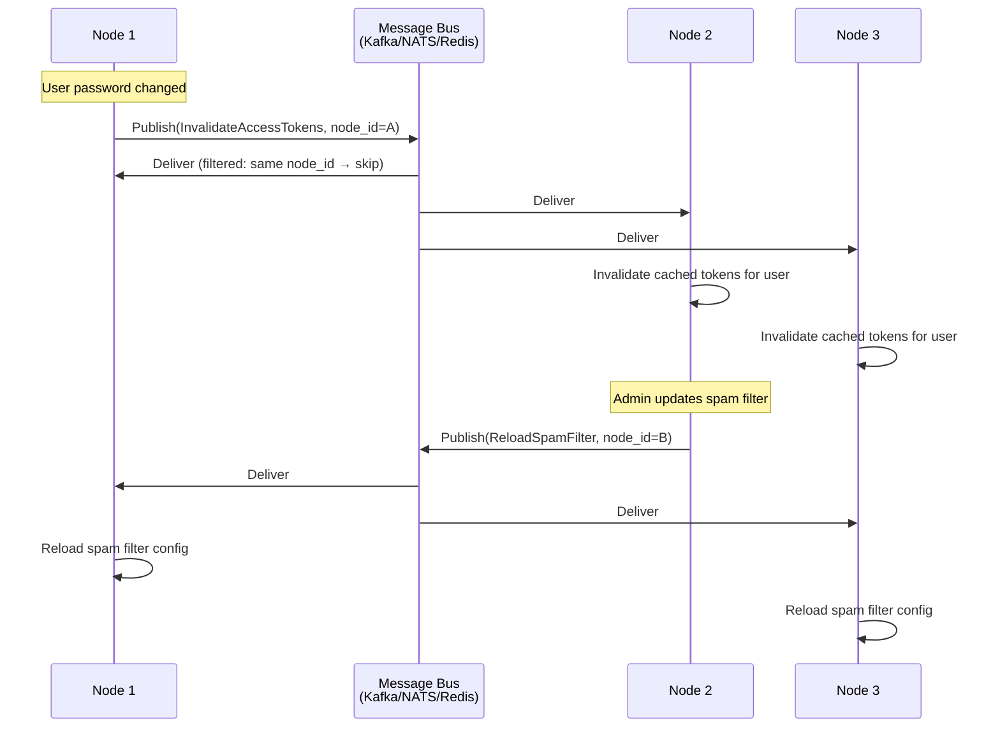
```mermaid
sequenceDiagram
    participant N1 as Node 1
    participant BUS as Message Bus<br/>(Kafka/NATS/Redis)
    participant N2 as Node 2
    participant N3 as Node 3

    Note over N1: User password changed
    N1->>BUS: Publish(InvalidateAccessTokens, node_id=A)

    BUS->>N1: Deliver (filtered: same node_id → skip)
    BUS->>N2: Deliver
    BUS->>N3: Deliver

    N2->>N2: Invalidate cached tokens for user
    N3->>N3: Invalidate cached tokens for user

    Note over N2: Admin updates spam filter
    N2->>BUS: Publish(ReloadSpamFilter, node_id=B)
    BUS->>N1: Deliver
    BUS->>N3: Deliver
    N1->>N1: Reload spam filter config
    N3->>N3: Reload spam filter config
```

### 9.3 Scaling Strategy

| Component | Horizontal Scaling | Notes |
|-----------|-------------------|-------|
| **RMail nodes** | ✅ Stateless (all state in shared DB) | Add nodes behind load balancer |
| **PostgreSQL** | Read replicas + connection pooling | `SQLReadReplica` enterprise feature |
| **Blob storage** | ✅ S3 (effectively unlimited) | `ShardedBlob` enterprise feature |
| **Search** | ✅ ElasticSearch/Meilisearch clusters | External service scaling |
| **Redis** | ✅ Redis Cluster | In-memory caching |
| **Message bus** | ✅ Kafka/NATS clusters | High availability built-in |

---

## 10. Multi-Tenancy Model

### 10.1 Tenant Isolation

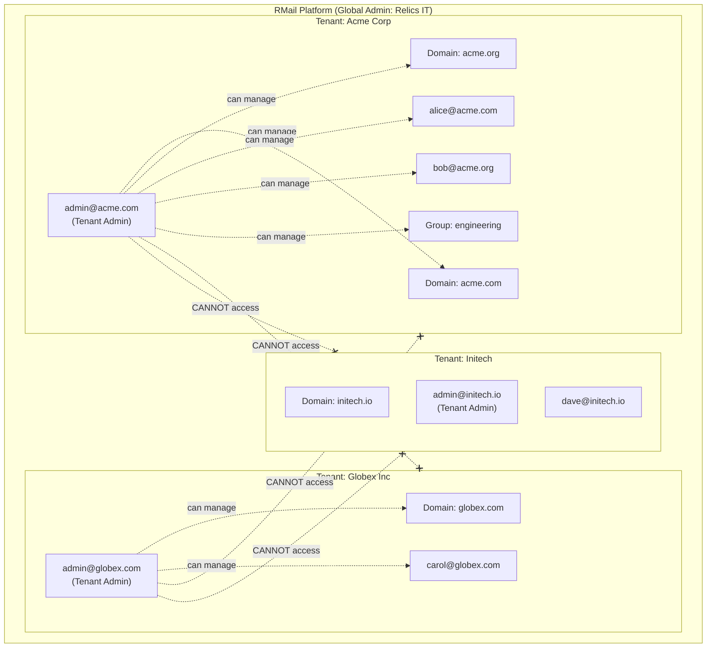
```mermaid
graph TB
    subgraph Platform["RMail Platform (Global Admin: Relics IT)"]

        subgraph T1["Tenant: Acme Corp"]
            D1["Domain: acme.com"]
            D2["Domain: acme.org"]
            U1["admin@acme.com<br/>(Tenant Admin)"]
            U2["alice@acme.com"]
            U3["bob@acme.org"]
            G1["Group: engineering"]
        end

        subgraph T2["Tenant: Globex Inc"]
            D3["Domain: globex.com"]
            U4["admin@globex.com<br/>(Tenant Admin)"]
            U5["carol@globex.com"]
        end

        subgraph T3["Tenant: Initech"]
            D4["Domain: initech.io"]
            U6["admin@initech.io<br/>(Tenant Admin)"]
            U7["dave@initech.io"]
        end
    end

    U1 -.->|"can manage"| D1 & D2 & U2 & U3 & G1
    U1 -.-x|"CANNOT access"| T2 & T3
    U4 -.->|"can manage"| D3 & U5
    U4 -.-x|"CANNOT access"| T1 & T3
```

### 10.2 Data Isolation Mechanism

All queries are automatically scoped by `tenant_id`:

```
┌──────────────────────────────────────────────────────┐
│                   API Request                         │
│         (from user alice@acme.com)                    │
├──────────────────────────────────────────────────────┤
│                                                       │
│  1. Authenticate → AccessToken { tenant_id: 42 }      │
│                                                       │
│  2. Query: SELECT * FROM emails WHERE account_id = ?  │
│     → Automatically filtered: AND tenant_id = 42      │
│                                                       │
│  3. Permission check:                                 │
│     → user.permissions & required_permission != 0     │
│     → tenant_id matches resource's tenant_id          │
│                                                       │
│  4. Response: Only data belonging to tenant 42         │
│                                                       │
└──────────────────────────────────────────────────────┘
```

### 10.3 Organization Provisioning

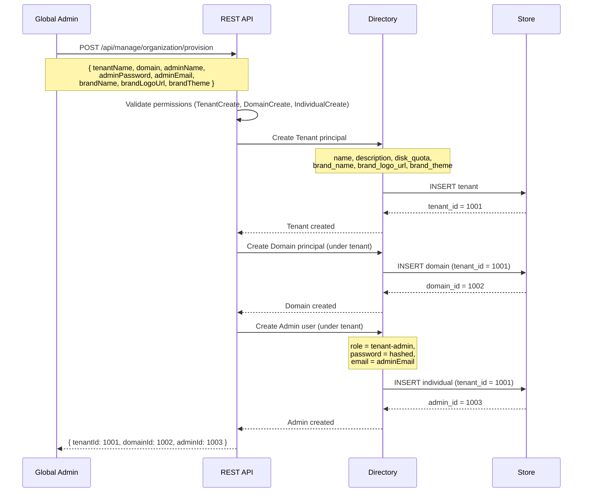
```mermaid
sequenceDiagram
    participant GA as Global Admin
    participant API as REST API
    participant D as Directory
    participant S as Store

    GA->>API: POST /api/manage/organization/provision
    Note over GA,API: { tenantName, domain, adminName,<br/>adminPassword, adminEmail,<br/>brandName, brandLogoUrl, brandTheme }

    API->>API: Validate permissions (TenantCreate, DomainCreate, IndividualCreate)

    API->>D: Create Tenant principal
    Note over D: name, description, disk_quota,<br/>brand_name, brand_logo_url, brand_theme
    D->>S: INSERT tenant
    S-->>D: tenant_id = 1001
    D-->>API: Tenant created

    API->>D: Create Domain principal (under tenant)
    D->>S: INSERT domain (tenant_id = 1001)
    S-->>D: domain_id = 1002
    D-->>API: Domain created

    API->>D: Create Admin user (under tenant)
    Note over D: role = tenant-admin,<br/>password = hashed,<br/>email = adminEmail
    D->>S: INSERT individual (tenant_id = 1001)
    S-->>D: admin_id = 1003
    D-->>API: Admin created

    API-->>GA: { tenantId: 1001, domainId: 1002, adminId: 1003 }
```

---

## 11. Deployment Topologies

### 11.1 Single-Node (Development / Small Org)

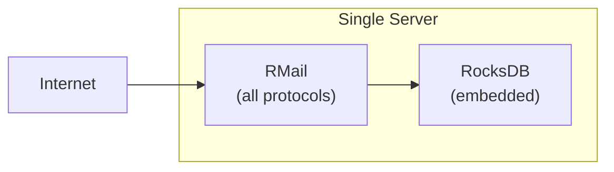
```mermaid
graph LR
    subgraph Host["Single Server"]
        RM["RMail<br/>(all protocols)"]
        RK["RocksDB<br/>(embedded)"]
    end

    INTERNET["Internet"] --> RM
    RM --> RK
```

**Configuration:** `config.toml` with RocksDB for all storage roles.  
**Best for:** Personal use, small teams, development environments.

### 11.2 Docker Compose (Self-Hosted Production)

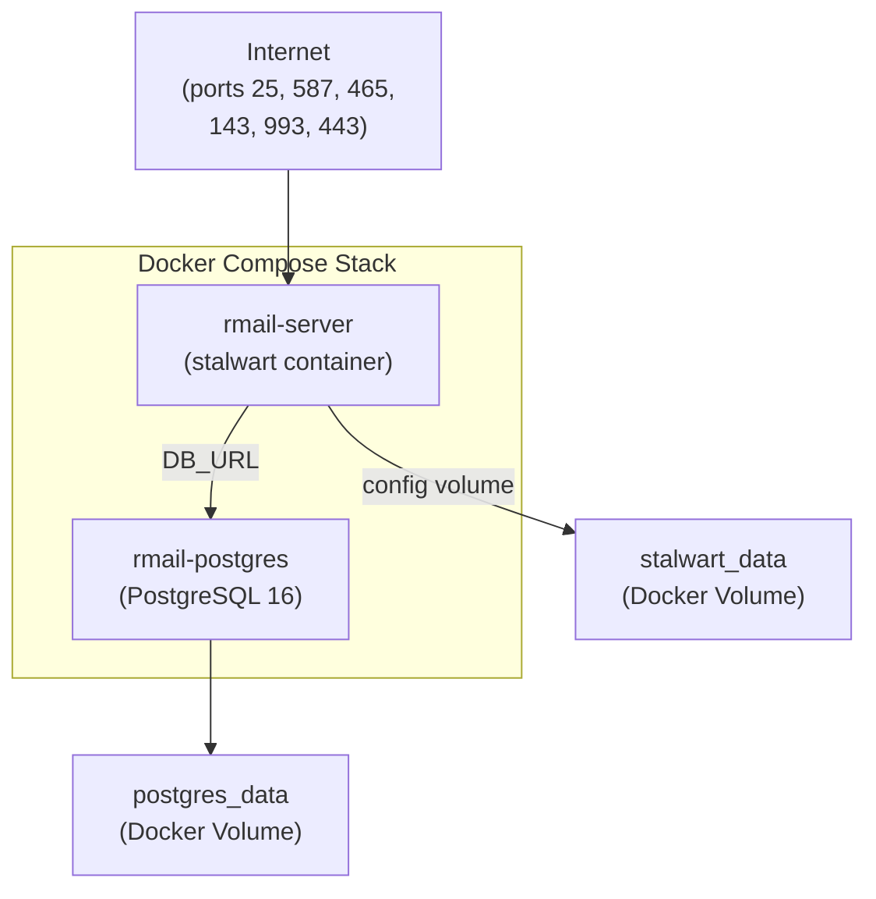
```mermaid
graph TB
    subgraph Docker["Docker Compose Stack"]
        RM["rmail-server<br/>(stalwart container)"]
        PG["rmail-postgres<br/>(PostgreSQL 16)"]
    end

    INTERNET["Internet<br/>(ports 25, 587, 465,<br/>143, 993, 443)"] --> RM
    RM -->|"DB_URL"| PG
    RM -->|"config volume"| VOL1["stalwart_data<br/>(Docker Volume)"]
    PG --> VOL2["postgres_data<br/>(Docker Volume)"]
```

**Configuration:** `multi-org-config.toml` with PostgreSQL.  
**Best for:** Small-to-medium multi-tenant deployments.

### 11.3 Railway (Cloud Managed)

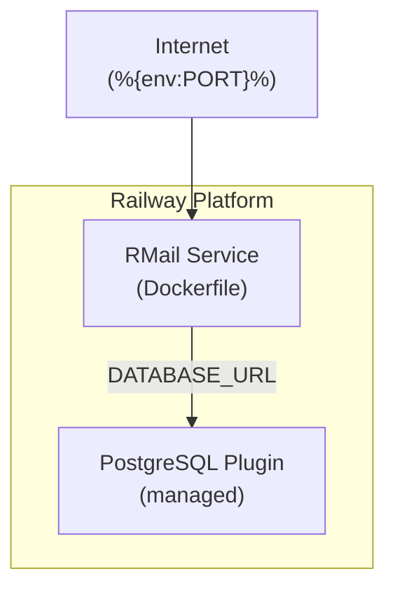
```mermaid
graph TB
    subgraph Railway["Railway Platform"]
        RM["RMail Service<br/>(Dockerfile)"]
        PG["PostgreSQL Plugin<br/>(managed)"]
    end

    INTERNET["Internet<br/>(%{env:PORT}%)"] --> RM
    RM -->|"DATABASE_URL"| PG
```

**Configuration:** `railway-config.toml` with Railway-provided `DATABASE_URL` and `PORT`.  
**Best for:** Quick deployment, managed infrastructure, no mail port access needed.

### 11.4 Production Cluster (Enterprise)

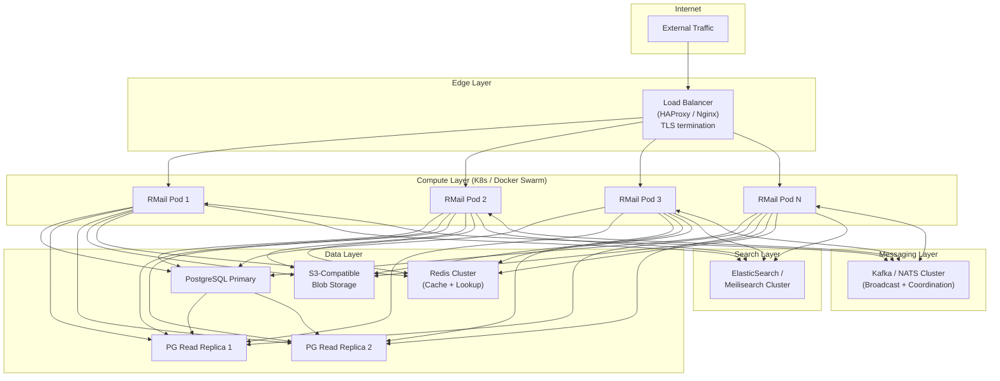
```mermaid
graph TB
    subgraph Internet
        EXT["External Traffic"]
    end

    subgraph Edge["Edge Layer"]
        LB["Load Balancer<br/>(HAProxy / Nginx)<br/>TLS termination"]
    end

    subgraph Compute["Compute Layer (K8s / Docker Swarm)"]
        N1["RMail Pod 1"]
        N2["RMail Pod 2"]
        N3["RMail Pod 3"]
        NN["RMail Pod N"]
    end

    subgraph Data["Data Layer"]
        PG_PRIMARY["PostgreSQL Primary"]
        PG_REPLICA1["PG Read Replica 1"]
        PG_REPLICA2["PG Read Replica 2"]
        S3["S3-Compatible<br/>Blob Storage"]
        REDIS["Redis Cluster<br/>(Cache + Lookup)"]
    end

    subgraph Search_Layer["Search Layer"]
        ES["ElasticSearch /<br/>Meilisearch Cluster"]
    end

    subgraph Messaging["Messaging Layer"]
        KAFKA["Kafka / NATS Cluster<br/>(Broadcast + Coordination)"]
    end

    EXT --> LB
    LB --> N1 & N2 & N3 & NN

    N1 & N2 & N3 & NN --> PG_PRIMARY
    N1 & N2 & N3 & NN --> PG_REPLICA1 & PG_REPLICA2
    N1 & N2 & N3 & NN --> S3
    N1 & N2 & N3 & NN --> REDIS
    N1 & N2 & N3 & NN --> ES
    N1 & N2 & N3 & NN <--> KAFKA

    PG_PRIMARY --> PG_REPLICA1 & PG_REPLICA2
```

---

## 12. API Surface

### 12.1 Endpoint Map

```
/api/
├── oauth                          # OAuth2 token exchange
├── manage/
│   ├── principal                  # CRUD: users, tenants, domains, groups, lists, roles
│   ├── organization/provision     # One-call org provisioning
│   ├── settings                   # Server/tenant configuration
│   ├── dkim                       # DKIM key management
│   ├── queue                      # SMTP queue inspection & control
│   ├── reports                    # DMARC/TLS-RPT report viewer
│   ├── dns                        # DNS record validation
│   ├── store                      # Storage backend management
│   ├── reload                     # Configuration hot-reload
│   ├── logs                       # Log viewer with search
│   ├── spam-filter                # Spam filter configuration
│   ├── troubleshoot               # Diagnostics & health checks
│   └── telemetry                  # Metrics & tracing (enterprise)
│
/jmap/
│   └── api                        # JMAP Core (RFC 8620)
│       ├── Email/*                # Email CRUD, search, threads
│       ├── Mailbox/*              # Mailbox management
│       ├── Calendar/*             # Calendar operations
│       ├── CalendarEvent/*        # Event scheduling
│       ├── Contact/*              # Contact management
│       ├── File/*                 # File storage
│       ├── Identity/*             # Send-as identities
│       └── Principal/*            # ACL principals
│
/dav/
│   ├── calendars/                 # CalDAV resources
│   ├── contacts/                  # CardDAV resources
│   └── files/                     # WebDAV file storage
│
/.well-known/
│   ├── caldav                     # CalDAV discovery
│   ├── carddav                    # CardDAV discovery
│   ├── autoconfig/                # Mozilla autoconfig
│   └── autodiscover/              # Microsoft autodiscovery
│
/auth/                             # OIDC / OAuth2 flows
/healthz/live                      # Health check endpoint
```

### 12.2 Request Flow Through HTTP Layer

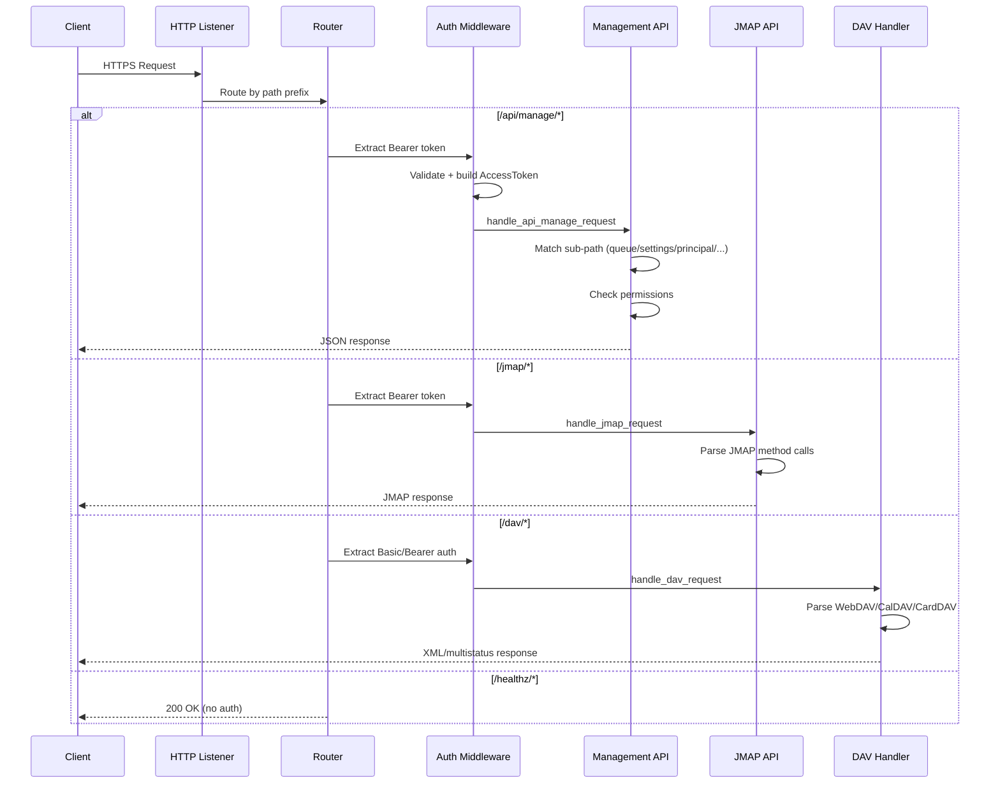
```mermaid
sequenceDiagram
    participant C as Client
    participant H as HTTP Listener
    participant R as Router
    participant A as Auth Middleware
    participant M as Management API
    participant J as JMAP API
    participant D as DAV Handler

    C->>H: HTTPS Request
    H->>R: Route by path prefix

    alt /api/manage/*
        R->>A: Extract Bearer token
        A->>A: Validate + build AccessToken
        A->>M: handle_api_manage_request
        M->>M: Match sub-path (queue/settings/principal/...)
        M->>M: Check permissions
        M-->>C: JSON response
    else /jmap/*
        R->>A: Extract Bearer token
        A->>J: handle_jmap_request
        J->>J: Parse JMAP method calls
        J-->>C: JMAP response
    else /dav/*
        R->>A: Extract Basic/Bearer auth
        A->>D: handle_dav_request
        D->>D: Parse WebDAV/CalDAV/CardDAV
        D-->>C: XML/multistatus response
    else /healthz/*
        R-->>C: 200 OK (no auth)
    end
```

---

## 13. Resillix-Modified Architecture

This section describes how the current RMail architecture is adapted for **Resillix** — a resilience-focused, enterprise-grade email and collaboration platform. Resillix builds on RMail's core with enhanced disaster recovery, compliance, geographic distribution, and operational intelligence.

### 13.1 Architecture Delta Summary

```
┌─────────────────────────────────────────────────────────────────────┐
│                    CURRENT RMail vs. RESILLIX                       │
├──────────────────────────────┬──────────────────────────────────────┤
│       Current RMail          │          Resillix Additions          │
├──────────────────────────────┼──────────────────────────────────────┤
│ Single-region deployment     │ Multi-region active-active           │
│ Manual tenant provisioning   │ Self-service tenant portal           │
│ Basic health endpoint        │ Deep observability + SLA dashboard   │
│ No compliance framework      │ Audit logging + data retention       │
│ Shared queue for all tenants │ Per-tenant queue isolation + priority│
│ Static spam rules            │ Adaptive ML pipeline per tenant      │
│ Manual DKIM/DMARC setup      │ Automated DNS + cert provisioning    │
│ Single branding layer        │ Full white-label platform            │
│ No webhook/event system      │ Event-driven integration bus         │
│ Basic rate limiting          │ Intelligent rate limiting + circuit  │
│                              │   breakers                           │
└──────────────────────────────┴──────────────────────────────────────┘
```

### 13.2 Resillix High-Level Architecture

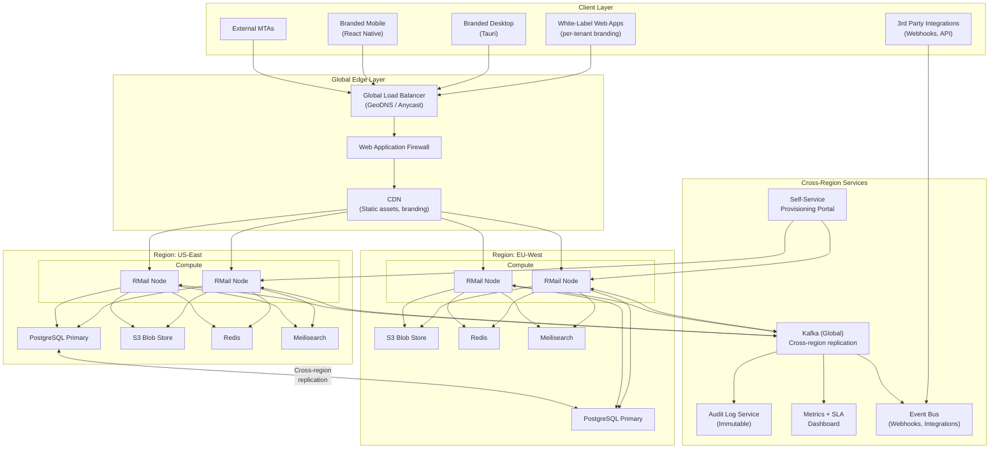
```mermaid
graph TB
    subgraph Clients["Client Layer"]
        WL_WEB["White-Label Web Apps<br/>(per-tenant branding)"]
        WL_DESK["Branded Desktop<br/>(Tauri)"]
        WL_MOB["Branded Mobile<br/>(React Native)"]
        EXT_MTA["External MTAs"]
        INTEGRATIONS["3rd Party Integrations<br/>(Webhooks, API)"]
    end

    subgraph Edge["Global Edge Layer"]
        GLB["Global Load Balancer<br/>(GeoDNS / Anycast)"]
        WAF["Web Application Firewall"]
        CDN["CDN<br/>(Static assets, branding)"]
    end

    subgraph Region1["Region: US-East"]
        subgraph R1_Compute["Compute"]
            R1_N1["RMail Node"]
            R1_N2["RMail Node"]
        end
        R1_DB["PostgreSQL Primary"]
        R1_S3["S3 Blob Store"]
        R1_REDIS["Redis"]
        R1_SEARCH["Meilisearch"]
    end

    subgraph Region2["Region: EU-West"]
        subgraph R2_Compute["Compute"]
            R2_N1["RMail Node"]
            R2_N2["RMail Node"]
        end
        R2_DB["PostgreSQL Primary"]
        R2_S3["S3 Blob Store"]
        R2_REDIS["Redis"]
        R2_SEARCH["Meilisearch"]
    end

    subgraph Shared["Cross-Region Services"]
        KAFKA_GLOBAL["Kafka (Global)<br/>Cross-region replication"]
        AUDIT["Audit Log Service<br/>(Immutable)"]
        METRICS["Metrics + SLA<br/>Dashboard"]
        EVENTS["Event Bus<br/>(Webhooks, Integrations)"]
        PROVISION["Self-Service<br/>Provisioning Portal"]
    end

    WL_WEB & WL_DESK & WL_MOB --> GLB
    EXT_MTA --> GLB
    INTEGRATIONS --> EVENTS
    GLB --> WAF --> CDN

    CDN --> R1_N1 & R1_N2
    CDN --> R2_N1 & R2_N2

    R1_N1 & R1_N2 --> R1_DB & R1_S3 & R1_REDIS & R1_SEARCH
    R2_N1 & R2_N2 --> R2_DB & R2_S3 & R2_REDIS & R2_SEARCH

    R1_N1 & R1_N2 <--> KAFKA_GLOBAL
    R2_N1 & R2_N2 <--> KAFKA_GLOBAL

    R1_DB <-->|"Cross-region<br/>replication"| R2_DB

    KAFKA_GLOBAL --> AUDIT & METRICS & EVENTS
    PROVISION --> R1_N1 & R2_N1
```

### 13.3 Key Resillix Modifications

#### 13.3.1 Multi-Region Active-Active

**Current:** Single-region cluster with shared PostgreSQL.  
**Resillix:** Active-active across multiple geographic regions with cross-region data replication.

```mermaid
graph LR
    subgraph US["US-East Region"]
        US_PG["PostgreSQL<br/>Primary (US)"]
        US_NODES["RMail Nodes<br/>(US)"]
    end

    subgraph EU["EU-West Region"]
        EU_PG["PostgreSQL<br/>Primary (EU)"]
        EU_NODES["RMail Nodes<br/>(EU)"]
    end

    US_NODES --> US_PG
    EU_NODES --> EU_PG

    US_PG <-->|"Bi-directional<br/>logical replication"| EU_PG

    GEODNS["GeoDNS"] -->|"US users"| US_NODES
    GEODNS -->|"EU users"| EU_NODES
```

**Implementation changes:**

| Component | Modification |
|-----------|-------------|
| `crates/store` | Add cross-region replication awareness, conflict resolution |
| `crates/services/broadcast` | Replace single-topic broadcast with region-aware pub/sub |
| `config.toml` | Add `[cluster.region]` configuration section |
| Queue Manager | Region-affinity for outbound delivery (send from geographically closest node) |

#### 13.3.2 Self-Service Tenant Portal

**Current:** Organization provisioning via admin-only REST API.  
**Resillix:** Self-service portal where organizations sign up, configure domains, and manage billing.

```mermaid
sequenceDiagram
    participant O as Org Admin
    participant P as Provisioning Portal
    participant API as RMail API
    participant DNS as DNS Automation
    participant CERT as Cert Manager
    participant BILL as Billing Service

    O->>P: Sign up (org name, domain, plan)
    P->>BILL: Create subscription
    BILL-->>P: Subscription active

    P->>API: POST /api/manage/organization/provision
    API-->>P: { tenantId, domainId, adminId }

    P->>DNS: Auto-configure DNS records
    Note over DNS: MX, SPF, DKIM, DMARC,<br/>autodiscover CNAME
    DNS-->>P: DNS configured

    P->>CERT: Provision TLS certificate
    CERT-->>P: Certificate issued

    P-->>O: Welcome email + admin credentials
    O->>P: Login → configure branding, users, etc.
```

**Implementation changes:**

| Component | Modification |
|-----------|-------------|
| `crates/http/management/organization.rs` | Extend provisioning with plan/quota tiers |
| New: `crates/http/management/portal.rs` | Self-service registration endpoints |
| New: DNS automation module | Integrate with Cloudflare/Route53 API for auto-DNS |
| New: Certificate automation | Extend ACME to provision per-domain certs automatically |

#### 13.3.3 Comprehensive Audit Logging

**Current:** Basic event tracing via OpenTelemetry.  
**Resillix:** Immutable audit log for every administrative action, with compliance reporting.

```mermaid
graph LR
    subgraph Actions["Auditable Events"]
        A1["User CRUD"]
        A2["Auth attempts"]
        A3["Config changes"]
        A4["Queue operations"]
        A5["Permission grants"]
        A6["Data access"]
    end

    subgraph Pipeline["Audit Pipeline"]
        CAPTURE["Event Capture<br/>(in-process)"]
        SERIALIZE["Serialize<br/>(structured JSON)"]
        PUBLISH["Publish to<br/>Audit Topic"]
    end

    subgraph Storage_A["Audit Storage"]
        IMMUTABLE["Immutable Log Store<br/>(append-only)"]
        INDEX["Search Index<br/>(for queries)"]
        ARCHIVE["Long-term Archive<br/>(S3 / cold storage)"]
    end

    A1 & A2 & A3 & A4 & A5 & A6 --> CAPTURE
    CAPTURE --> SERIALIZE --> PUBLISH
    PUBLISH --> IMMUTABLE & INDEX
    IMMUTABLE -->|"retention policy"| ARCHIVE
```

**Implementation changes:**

| Component | Modification |
|-----------|-------------|
| `crates/trc` | Add `AuditEvent` variant with structured metadata |
| `crates/common/src/auth` | Emit audit events on every auth decision |
| `crates/http/management` | Wrap all management endpoints with audit middleware |
| `crates/services` | New `audit_service` for async audit event processing |
| Config | Add `[audit]` section with retention policies, export targets |

#### 13.3.4 Per-Tenant Queue Isolation & Priority

**Current:** Single shared SMTP queue for all tenants.  
**Resillix:** Isolated per-tenant queues with configurable priority and SLA guarantees.

```mermaid
graph TB
    subgraph Inbound["Inbound Messages"]
        M1["Message for Tenant A"]
        M2["Message for Tenant B"]
        M3["Message for Tenant C"]
    end

    subgraph Classifier["Queue Classifier"]
        QC["Tenant-aware<br/>Queue Router"]
    end

    subgraph Queues["Isolated Queues"]
        QA["Queue: Tenant A<br/>Priority: HIGH<br/>Concurrency: 64"]
        QB["Queue: Tenant B<br/>Priority: NORMAL<br/>Concurrency: 32"]
        QC_Q["Queue: Tenant C<br/>Priority: LOW<br/>Concurrency: 16"]
    end

    subgraph Delivery["Outbound Delivery"]
        D["Delivery Workers<br/>(weighted scheduling)"]
    end

    M1 --> QC --> QA
    M2 --> QC --> QB
    M3 --> QC --> QC_Q

    QA -->|"weight: 4"| D
    QB -->|"weight: 2"| D
    QC_Q -->|"weight: 1"| D
```

**Implementation changes:**

| Component | Modification |
|-----------|-------------|
| `crates/smtp/src/queue/manager.rs` | Tenant-aware queue partitioning |
| `crates/smtp/src/queue/throttle.rs` | Per-tenant rate limits and priority weights |
| Config | Add `[queue.tenant-policy]` for per-tenant SLA definitions |

#### 13.3.5 Event-Driven Integration Bus

**Current:** No external event/webhook system.  
**Resillix:** Publish domain events to external systems via webhooks and event streams.

```mermaid
graph LR
    subgraph Events["Domain Events"]
        E1["email.received"]
        E2["email.sent"]
        E3["email.bounced"]
        E4["user.created"]
        E5["user.login"]
        E6["tenant.provisioned"]
        E7["quota.exceeded"]
    end

    subgraph Bus["Event Bus"]
        EB["Event Router<br/>(filter + transform)"]
    end

    subgraph Targets["Delivery Targets"]
        WH["Webhooks<br/>(HTTP POST)"]
        KF["Kafka Topic<br/>(streaming)"]
        SQS["AWS SQS / GCP Pub/Sub"]
        WS["WebSocket<br/>(real-time)"]
    end

    E1 & E2 & E3 & E4 & E5 & E6 & E7 --> EB
    EB --> WH & KF & SQS & WS
```

**Implementation changes:**

| Component | Modification |
|-----------|-------------|
| New: `crates/events` | Event definition, serialization, routing |
| `crates/smtp` | Emit events on delivery lifecycle |
| `crates/http/management` | Emit events on admin actions |
| `crates/services` | New `event_dispatcher` background service |
| Config | Add `[events.webhooks]` subscription configuration |

#### 13.3.6 Adaptive Spam Intelligence

**Current:** Static rule-based + statistical classifier + LLM analysis.  
**Resillix:** Per-tenant adaptive ML pipeline that learns from each organization's traffic patterns.

```mermaid
graph TB
    subgraph Input["Incoming Email"]
        MSG["Message"]
    end

    subgraph Pipeline["Resillix Spam Pipeline"]
        STAGE1["Stage 1: Connection Checks<br/>(IP reputation, DNSBL, rate)"]
        STAGE2["Stage 2: Envelope Checks<br/>(SPF, sender reputation)"]
        STAGE3["Stage 3: Content Analysis<br/>(rules, statistical classifier)"]
        STAGE4["Stage 4: LLM Analysis<br/>(phishing, social engineering)"]
        STAGE5["Stage 5: Tenant Model<br/>(per-org trained classifier)"]
    end

    subgraph Feedback["Feedback Loop"]
        USER_FB["User Actions<br/>(mark spam / not spam)"]
        TRAIN["Model Trainer<br/>(per-tenant)"]
    end

    MSG --> STAGE1 --> STAGE2 --> STAGE3 --> STAGE4 --> STAGE5
    STAGE5 -->|"verdict"| DELIVER["Deliver / Junk / Reject"]

    USER_FB --> TRAIN --> STAGE5
```

**Implementation changes:**

| Component | Modification |
|-----------|-------------|
| `crates/spam-filter` | Add tenant-scoped model storage and training pipeline |
| `crates/nlp` | Per-tenant feature vectors and classification thresholds |
| `crates/services` | Background model retraining job in task manager |
| Config | Add `[spam-filter.adaptive]` per-tenant learning configuration |

#### 13.3.7 Full White-Label Platform

**Current:** Basic tenant branding fields (`brandName`, `brandLogoUrl`, `brandTheme`).  
**Resillix:** Complete white-label platform with custom domains, themed apps, and branded communications.

```mermaid
graph TB
    subgraph WL["White-Label Stack"]
        PORTAL["Branded Admin Portal<br/>(per-tenant CSS/logo/domain)"]
        WEBMAIL["Branded Webmail<br/>(JMAP-powered)"]
        DESKTOP["Branded Desktop App<br/>(Tauri, custom installer)"]
        MOBILE["Branded Mobile App<br/>(custom app icon/name)"]
    end

    subgraph Config_WL["Branding Configuration"]
        BRAND_API["GET /api/branding<br/>(tenant-scoped)"]
        BRAND_DB["Tenant Branding Store<br/>(name, logo, theme,<br/>custom domain, CSS,<br/>email templates)"]
    end

    subgraph DNS_WL["Custom Domain Mapping"]
        CNAME["client.example.com<br/>→ CNAME mail.resillix.io"]
        SNI["TLS SNI routing<br/>(domain → tenant)"]
    end

    BRAND_API --> BRAND_DB
    PORTAL & WEBMAIL & DESKTOP & MOBILE --> BRAND_API
    CNAME --> SNI --> PORTAL & WEBMAIL
```

**Implementation changes:**

| Component | Modification |
|-----------|-------------|
| `crates/directory/src/lib.rs` | Extend branding with `CustomDomain`, `EmailTemplate`, `CustomCss` |
| `crates/http` | Dynamic SNI-to-tenant routing, branding API endpoint |
| `crates/common/listener/tls.rs` | Multi-tenant SNI certificate selection |
| New: client apps | Tauri desktop, React Native mobile with dynamic branding |

#### 13.3.8 Operational Intelligence Dashboard

**Current:** Basic OpenTelemetry metrics + log viewer.  
**Resillix:** Comprehensive SLA monitoring, capacity planning, and anomaly detection.

```mermaid
graph TB
    subgraph Collect["Data Collection"]
        METRICS_C["Metrics Collector<br/>(per-node)"]
        LOGS_C["Structured Logs"]
        TRACES_C["Distributed Traces"]
        AUDIT_C["Audit Events"]
    end

    subgraph Process["Processing"]
        AGG["Aggregation Engine"]
        ANOMALY["Anomaly Detector"]
        SLA["SLA Calculator"]
    end

    subgraph Dashboard["Resillix Dashboard"]
        OVERVIEW["System Overview<br/>(nodes, uptime, throughput)"]
        TENANT_VIEW["Per-Tenant View<br/>(usage, quota, SLA)"]
        ALERT["Alert Manager<br/>(email, webhook, PagerDuty)"]
        CAPACITY["Capacity Planning<br/>(growth projections)"]
    end

    METRICS_C & LOGS_C & TRACES_C & AUDIT_C --> AGG
    AGG --> ANOMALY & SLA
    ANOMALY --> ALERT
    SLA --> TENANT_VIEW
    AGG --> OVERVIEW & CAPACITY
```

### 13.4 Resillix Configuration Extension

The existing TOML configuration is extended with new sections:

```toml
# ─── Resillix Additions ──────────────────────────────────

[cluster.region]
name = "us-east-1"
peers = ["eu-west-1.resillix.internal:9443"]
replication = "async"             # sync | async | quorum

[audit]
enabled = true
store = "audit-postgres"          # Separate DB for audit logs
retention = "365d"                # Compliance retention period
export.format = "json"
export.target = "s3://audit-archive/"

[events]
enabled = true

[events.webhook."customer-crm"]
url = "https://hooks.example.com/email-events"
events = ["email.received", "email.bounced", "user.created"]
secret = "%{env:WEBHOOK_SECRET}%"
retry.max-attempts = 5
retry.backoff = "exponential"

[queue.tenant-policy."premium"]
priority = "high"
concurrency = 64
rate-limit = "10000/hour"
retry.interval = "30m, 6h, 1d, 3d"

[queue.tenant-policy."standard"]
priority = "normal"
concurrency = 32
rate-limit = "5000/hour"

[spam-filter.adaptive]
enabled = true
training.min-samples = 100
training.schedule = "daily"
model-store = "s3://spam-models/"

[portal]
enabled = true
signup.enabled = true
signup.require-domain-verification = true
signup.default-plan = "standard"
billing.provider = "stripe"
billing.api-key = "%{env:STRIPE_KEY}%"

[branding.defaults]
primary-color = "#1976D2"
font-family = "Inter, sans-serif"
```

### 13.5 Resillix Migration Path

```mermaid
graph LR
    subgraph Phase1["Phase 1: Foundation<br/>(Current)"]
        P1A["✅ Multi-tenancy"]
        P1B["✅ Branding fields"]
        P1C["✅ Org provisioning API"]
        P1D["✅ RBAC + permissions"]
    end

    subgraph Phase2["Phase 2: Platform<br/>(Next)"]
        P2A["Audit logging"]
        P2B["Event bus + webhooks"]
        P2C["Per-tenant queue isolation"]
        P2D["Self-service portal"]
    end

    subgraph Phase3["Phase 3: Intelligence<br/>(Future)"]
        P3A["Adaptive spam ML"]
        P3B["SLA dashboard"]
        P3C["Anomaly detection"]
        P3D["Capacity planning"]
    end

    subgraph Phase4["Phase 4: Global<br/>(Long-term)"]
        P4A["Multi-region active-active"]
        P4B["GeoDNS routing"]
        P4C["Cross-region replication"]
        P4D["Full white-label apps"]
    end

    Phase1 --> Phase2 --> Phase3 --> Phase4
```

### 13.6 Resillix Component Changes Summary

| Crate | Current Role | Resillix Modifications |
|-------|-------------|----------------------|
| `crates/main` | Boot + spawn protocols | Add region config, event bus init |
| `crates/http` | REST API + JMAP + DAV | Self-service portal, branding API, audit middleware |
| `crates/smtp/queue` | Shared queue manager | Per-tenant queue partitioning, priority scheduling |
| `crates/store` | Storage abstraction | Cross-region replication, audit store |
| `crates/directory` | Principal management | Extended branding, custom domains, plan/tier fields |
| `crates/services` | Background services | Event dispatcher, audit processor, model trainer |
| `crates/spam-filter` | Static rules + ML | Per-tenant adaptive models, feedback loop |
| `crates/common/listener` | TCP/TLS listeners | SNI-based tenant routing, circuit breakers |
| `crates/common/auth` | Auth engine | Audit event emission, enhanced rate limiting |
| `crates/trc` | Tracing + telemetry | Audit events, SLA metrics, anomaly detection hooks |
| New: `crates/events` | — | Domain event definitions, webhook dispatcher |
| New: `crates/portal` | — | Self-service tenant onboarding |
| New: `crates/audit` | — | Immutable audit log, compliance reporting |

---

## Appendix: Crate Map

Complete listing of all 27 workspace crates:

```
crates/
├── main/           # Binary: stalwart server entry point
├── cli/            # Binary: stalwart-cli admin tool
├── smtp/           # SMTP/LMTP protocol implementation
├── imap/           # IMAP4rev2/rev1 protocol implementation
├── pop3/           # POP3 protocol implementation
├── jmap/           # JMAP protocol (mail, calendars, contacts, files)
├── http/           # HTTP server, REST management API, routing
├── dav/            # WebDAV/CalDAV/CardDAV implementation
├── managesieve/    # ManageSieve protocol
├── email/          # Email parsing (RFC 5322, MIME)
├── spam-filter/    # Spam/phishing detection engine
├── nlp/            # Natural language processing
├── groupware/      # Calendar/contacts collaboration
├── store/          # Storage abstraction (11 backends)
├── directory/      # User/tenant directory service
├── common/         # Shared: auth, config, listener, DNS, telemetry
├── services/       # Background: housekeeper, task mgr, broadcast
├── migration/      # Database schema migrations
├── types/          # Core type definitions
├── trc/            # Distributed tracing & events
├── utils/          # Utilities (cache, snowflake IDs, crypto)
├── imap-proto/     # IMAP protocol definitions
├── jmap-proto/     # JMAP protocol definitions
├── http-proto/     # HTTP protocol definitions
├── dav-proto/      # DAV protocol definitions
└── tests/          # Integration test suite
```

---

*Document generated from codebase analysis of RMail v0.15.x (Stalwart fork).*  
*Operated by Relics IT Services.*
